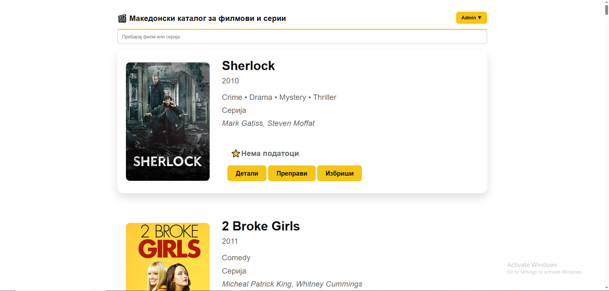
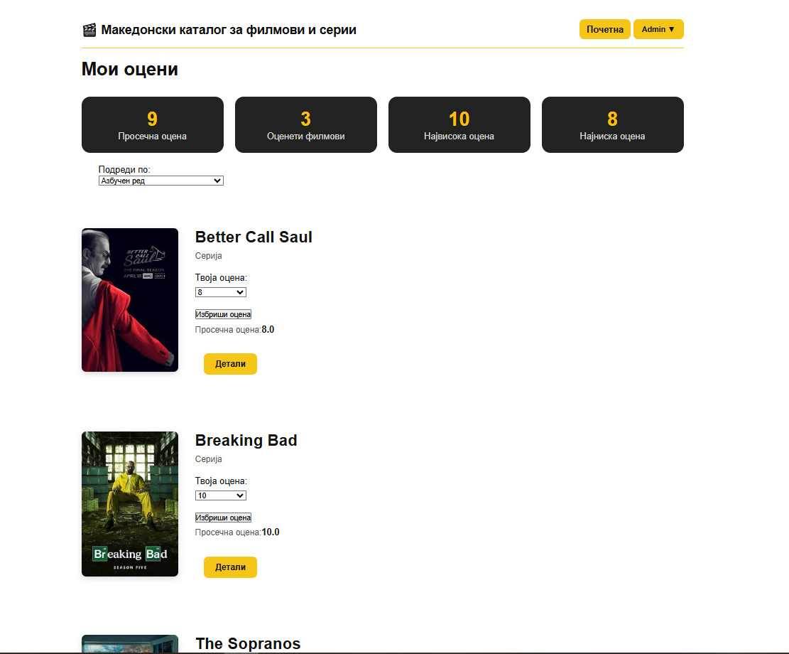
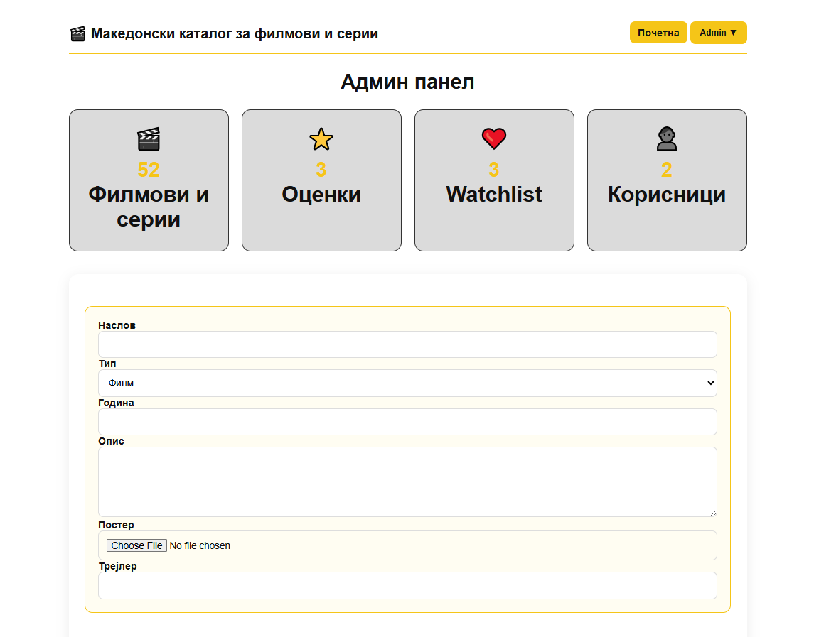

# 🎬 Movie Hub

Movie Hub е веб апликација за управување и организирање на филмови и серии. Проектот е изработен како личен проект со цел практична примена и надградување на знаењата од веб програмирање.

---

## 📌 Главни функции

- Регистрација и најава на корисници
- Пребарување на филмови и серии
- Детален приказ на информации за филмови
- Омилени филмови
- Кориснички профил
- Администраторски панел
- Додавање, измена и бришење на содржини

---

## 🛠 Користени технологии

- HTML5
- CSS3
- JavaScript
- PHP
- MySQL
- XAMPP

---

## 📷 Screenshots

### 🏠 Home Page



---

### 🎬 Movie Details


---

### ⭐ My Ratings



---

### ❤️ My Watchlist


---

### 🛠️ Admin Panel



---

## ⚙️ Инсталација

1. Копирај го репозиториумот.
2. Копирај ја папката во `xampp/htdocs`.
3. Стартувај ги Apache и MySQL преку XAMPP.
4. Импортирај ја базата `moviehub.sql` во phpMyAdmin.
5. Отвори:

http://localhost/Moviehub

---

## 📂 Project Structure

```text
movie-hub
│
├── Database/
│   └── moviehub.sql
│
├── Screenshots/
│   ├── home-page.png
│   ├── movie-details.png
│   ├── my-ratings.png
│   ├── my-watchlist.png
│   └── admin-panel.png
│
├── Source/
│   ├── index.php
│   ├── movie.php
│   ├── dashboard.php
│   ├── login.html
│   ├── login_process.php
│   ├── signup.html
│   ├── register.php
│   ├── logout.php
│   ├── navbar.php
│   ├── session_check.php
│   ├── database.php
│   ├── add_movie.php
│   ├── edit_movie.php
│   ├── update_movie.php
│   ├── delete_movie.php
│   ├── admin.php
│   ├── admin_check.php
│   ├── ratings.php
│   ├── rate.php
│   ├── watchlist.php
│   ├── watchlist_page.php
│   ├── remove_watchlist.php
│   ├── script.js
│   ├── admin.js
│   ├── style.css
│   ├── admin.css
│   └── settings.css
│
├── README.md
└── LICENSE
```

## 👨‍💻 Автор

Damjan Gjurik
